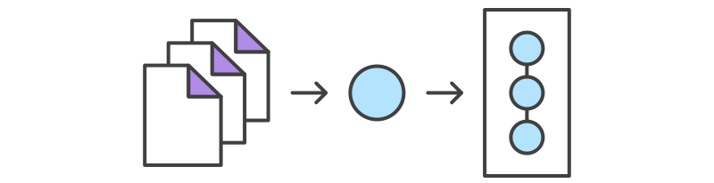
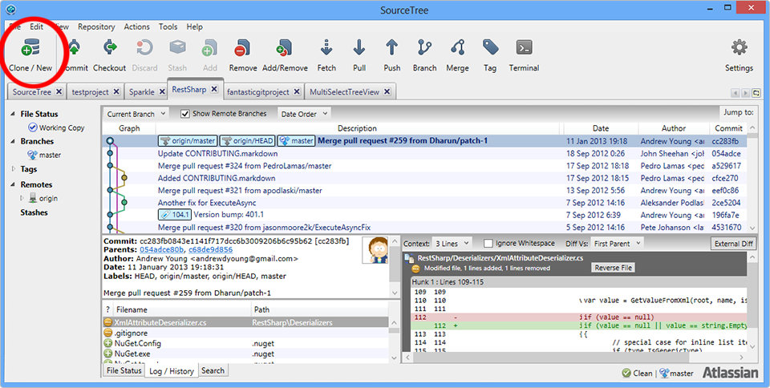
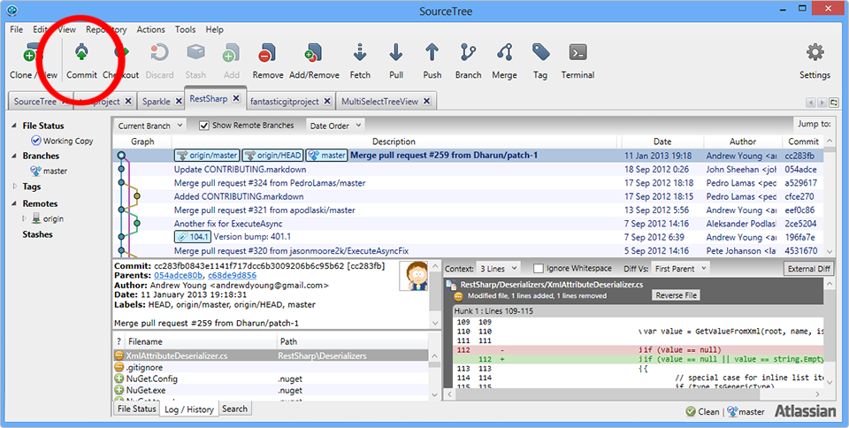
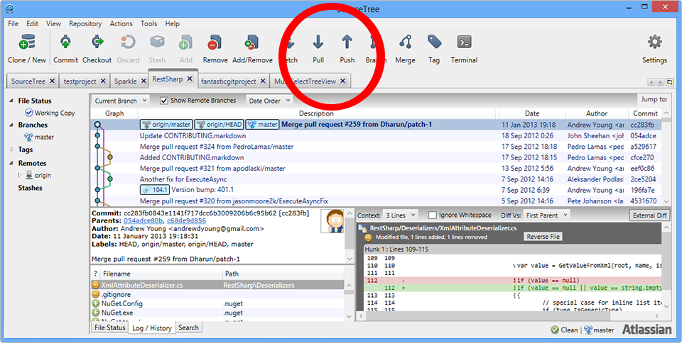

:title: Control de Versiones Git
:data-transition-duration: 1000
:css: css/base.css
:author: Xabi Bello

----

:class: slide

Control de Versiones Git
========================

Una introducción muy superficial... pero suficiente.

----

:data-x: 1000
:data-rotate-y: 90
:data-rotate-z: 90

Qué es Git
===========

* Git es un sistema de control de versiones muy flexible.

  Un VCS guarda los cambios en uno o más archivos a lo largo del tiempo de
  forma que se pueden consultar esos cambios en cualquier momento.

* "Yo ya tengo mis archivos en directorios divididos por versión".

  - Pueden ocurrir errores de todo tipo.

  - Colaboración muy difícil o imposible.

-----

:data-y: r1000

Centralizado vs Distribuido
===========================

* Los SCV clásicos eran centralizados: un repositorio central hacía el seguimiento,
  los clientes cogían los archivos de ese servidor.

* Después aparecieron los SCV distribuidos, donde cada cliente tiene una copia
  completa, la modifica y redistribuye los cambios.

  - "Copia de seguridad".

  - No hay un repo central que se pueda morir.

-----

:data-y: r1000

Estructura de Git
=================

* Git hace snapshots y los guarda en una nueva versión.

* Hay tres *status* en Git: Trabajo, Staging y Repo.

  - El **Trabajo** son nuestros archivos tal y como los vemos en el directorio.

  - El **Staging** son los archivos que entrarán en el próximo commit.

  - El **Repo** es la base de datos a la que se hace el commit y desde la que se
    copian los archivos de **Trabajo**.

Por ejemplo si queremos trabajar en la versión 1.4, pedimos al **Repo** que ponga
los archivos correspondientes a esa versión en nuestro directorio de **Trabajo**.

Si hemos hecho cambios en un archivo y lo queremos añadir al **Repo** primero
lo metemos en el **Staging**.

-----

:data-y: r1000

Git GUI
=======

.. image:: images/sourcetree.png
    :width: 800px

* Existen varias herramientas para usar Git. Usaremos SourceTree, una heramienta
  de Atlassian (Bitbucket). https://www.sourcetreeapp.com/

-----

:data-y: r1000

Comienzo
========

Se puede empezar un **Repo** local con ``init`` o ``clone`` de un **Repo** ya 
existente.

Una vez clonado/iniciado tendremos una copia de todo el **Repo** en nuestro
directorio de **Trabajo**. Podremos modificar/añadir archivos.

-----

:data-y: r1000

Modificar, Stage, Commit
========================

El flujo normal de trabajo es un ciclo:

#. Modificar o crear un (o varios) archivo.

#. Añadirlo al **Stage**.

#. Añadirlo al **Repo** (commit).

-----

:data-y: r1000

Push, Pull
==========

Si trabajamos con más gente en los mismos archivos

#. Hacemos una actualización del **Repo** remoto antes de trabajar (pull).

#. Seguimos el flujo habitual Modificar -> Stage -> Commit.

#. Actualizamos el **Repo** remoto con nuestros archivos (push).

-----

:data-y: r1000

Buenas prácticas
================

* Los commits deben ser lo más atómicos (indivisibles) posible. Evitar commits
  monstruosos.

* Si trabajamos en compartido, no modificar el árbol después de un push.

* Añadir una descripción a cada commit. No hay nada de malo en que la descripción
  del commit sea más extensa que la modificación.

-----

:data-y: r1000
:class: slide

PRO Git
=======

* Branching.

* Undo.

-----

:data-y: r1000

Branching
=========

* Creando un branch podemos trabajar en una sub-versión de testeo sin afectar
  a los demás.

.. image:: images/git_branch.svg
    :height: 600px

----

Undo
====

No existe comando "undo" en Git. Podemos hacer:

* **Reset** para deshacer cambios que no han sido compartidos.

* **Checkout** normalmente se usa para cambiar entre branches. Pero lo que hace
  realmente es cambiar entre snapshots. De esta forma podemos hacer un cambio
  a otro estado/snapshot.

* **Revert** hace un "undo" añadiendo los cambios que sean necesarios para hacer
  que el commit actual sea igual que uno anterior. No se pierde la historia.

----

Links
=====

Introducción rápida
-------------------

https://www.atlassian.com/git/tutorials/

Manual detallado
----------------
https://git-scm.com/documentation

Referencia completa
-------------------
https://git-scm.com/docs

Google
------

``how to [verbo] Git``

