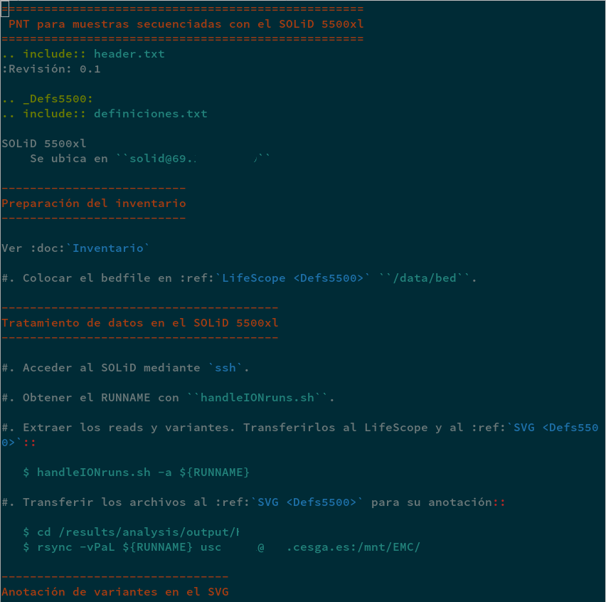
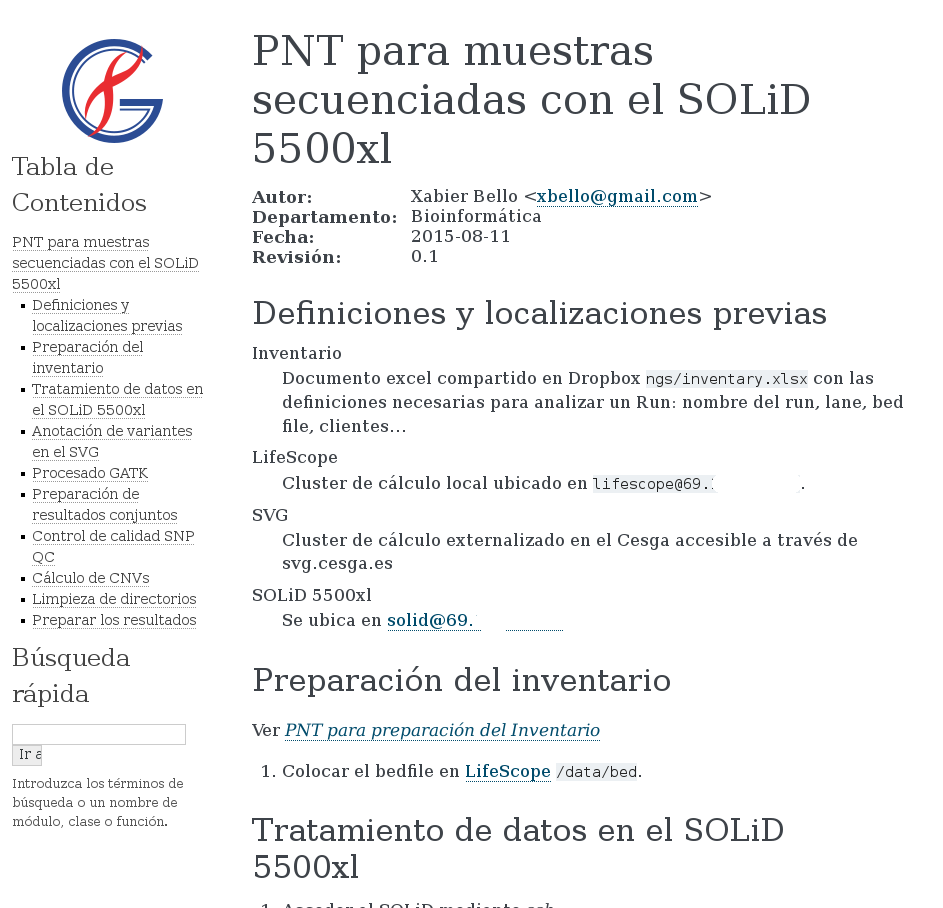
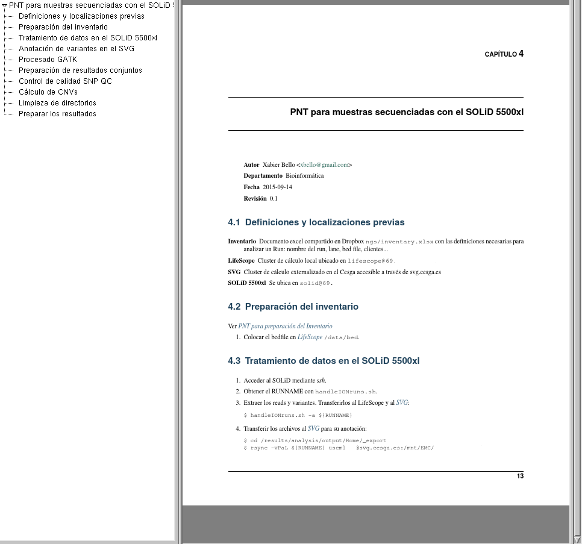

:title: Edición con reST
:data-transition-duration: 1000
:css: css/base.css
:author: Xabi Bello

----

:class: slide

Documentos con reST
===================

Tips rápidos para edición de textos con reST

----

:data-x: 1000
:data-rotate-y: 90
:data-rotate-z: 90

Qué es reST
===========

* reST es abreviatura de **reS**\ tructured\ **T**\ext.

* Es un conjunto de marcas simples para formatear textos.

* Se puede procesar a múltiples salidas.

-----

:data-y: r1000

Estructura del documento
========================

No están predefinidos, se ejecutan por orden de aparición:

  +-------------------+--------------------------+
  | Escribiendo...    | Obtenemos...             |
  +===================+==========================+
  | .. code::         |  .. raw:: html           |
  |                   |                          |
  |    Seccion        |    <h1>Sección</h1>      |
  |    =======        |                          |
  +-------------------+--------------------------+
  | .. code::         |  .. raw:: html           |
  |                   |                          |
  |    Subsección     |    <h2>Subsección</h2>   |
  |    ----------     |                          |
  +-------------------+--------------------------+
  | .. code::         |  .. raw:: html           |
  |                   |                          |
  |    Subsubsección  |    <h3>Subsubsección</h3>|
  |    .............  |                          |
  +-------------------+--------------------------+

-----

:data-y: r1000

Listas y definiciones
=====================

Para definir los pasos de un PNT usaremos listas y definiciones.

  +---------------------------+-----------------------------------------------+
  | Escribiendo...            | Obtenemos...                                  |
  +===========================+===============================================+
  | .. code::                 |  .. raw:: html                                |
  |                           |                                               |
  |    * Texto                |    <ul><li>Texto</li></ul>                    |
  +---------------------------+-----------------------------------------------+
  | .. code::                 |  .. raw:: html                                |
  |                           |                                               |
  |    # Texto                |    <ol><li>Texto</li></ol>                    |
  +---------------------------+-----------------------------------------------+
  | .. code::                 |  .. raw:: html                                |
  |                           |                                               |
  |    Texto                  |    <dl><dt><strong>Texto</strong></dt>        |
  |      Su definición        |      <dd>Su definición</dd>                   |
  |                           |    </dl>                                      |
  |                           |                                               |
  +---------------------------+-----------------------------------------------+

-----

:data-y: r1000

Inserciones
===========

A veces será útil insertar gráficos, código o enlaces.

.. code::

   .. image:: directorio/de/la/imagen.png

.. code:: python

   .. code:: python

      def print_zen():
          import this

.. code::

   `this`_ is a link

   .. this http://www.google.es

-----

:data-y: r1000

Texto
=====

Se puede modificar texto aislado como en cualquier editor (*inline markup*):

  +-------------------+-----------------------------+
  | Escribiendo...    | Obtenemos...                |
  +===================+=============================+
  | .. code::         |  .. raw:: html              |
  |                   |                             |
  |    **negrita**    |    <strong>negrita</strong> |
  +-------------------+-----------------------------+
  | .. code::         |  .. raw:: html              |
  |                   |                             |
  |    *cursiva*      |    <em>cursiva</em>         |
  +-------------------+-----------------------------+

Además se consideran *inline* enlaces, pies de página, citas...

-----

:data-y: r1000

Ejemplo
=======

-----

:data-x: r1000
:data-y: r0
:data-z: r1500

Salida HTML
===========

-----

:data-z: r1500

Salida PDF
==========

-----

:data-x: r-2000
:data-y: r1000
:data-z: r-3000

Links
=====

Introducción rápida
-------------------

http://sphinx-doc.org/rest.html

Manual completo
---------------

http://docutils.sourceforge.net/docs/ref/rst/restructuredtext.html

Google
------

``restructuredtext tutorial/manual/cheatsheet``

